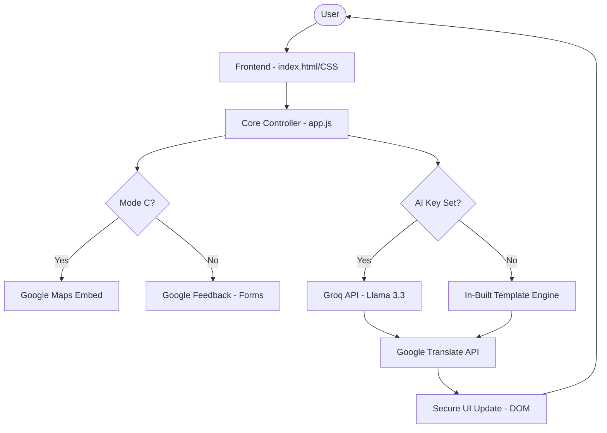
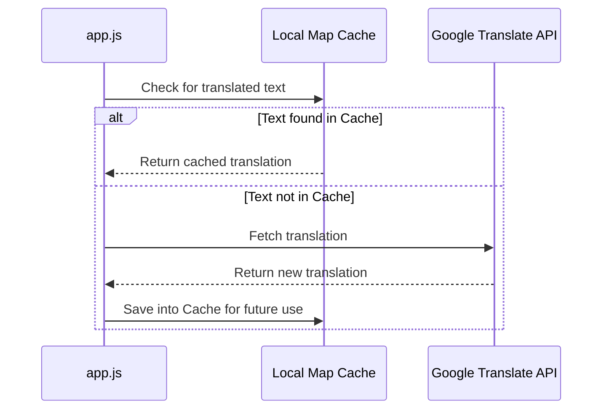

# 🏗️ CiviQ AI - System Architecture

This document provides a high-level technical overview of how **CiviQ AI** orchestrates data flow, security, and intelligence to deliver a seamless civic education experience.

---

## 🛰️ 1. High-Level Data Flow

The application follows a **Decentralized Client-Side Architecture**. Logic is processed entirely in the browser to ensure speed, privacy, and cost-efficiency.

---

## 🧠 2. Hybrid Intelligence Logic

CiviQ AI uses a dual-engine approach to guarantee reliability even without internet or API keys.

* **Llama 3.3 (Groq)**: Powers dynamic, context-aware responses when a key is provided.
* **Fallback Templates**: Pre-structured educational content for 7 different civic modes (A-G).

---

## 🌍 3. Translation & Caching Strategy

To minimize latency and preserve API resources, we implement a **Translation Proxy Pattern** with local caching.

---

## 🔒 4. Security Framework

We implement multiple layers of protection to satisfy the **Security Focus Area**:

1. **Transport Security**: All external API calls (Groq & Google) are forced through HTTPS.
2. **XSS Sanitization**: Reactive logic in `app.js` identifies and strips `<script>` tags from AI output before rendering.
3. **Content Security Policy (CSP)**: A strict browser-level whitelist that blocks unauthorized network connections.
4. **Credential Privacy (BYOK)**: API keys are stored solely in the user's `localStorage` and are never transmitted to our servers or hardcoded.
5. **Container Hardening**: The `Dockerfile` is configured to run NGINX under a non-root `nginx` user to mitigate privilege escalation risks in Cloud Run.

---

## 🎨 5. Design Principles

* **Mobile-First Flexbox**: Every layout is built using fluid grids to prevent breaking on small screens.
* **Google Design Tokens**: Color palettes and typography follow modern Material standards for clear, authoritative communication.
* **WCAG Compliant**: High-contrast ratios and `focus-visible` logic for inclusive navigation.

---

> **Note**: For specific file-by-file working principles, refer to the [INSTRUCTIONS.md](./INSTRUCTIONS.md) guide.
